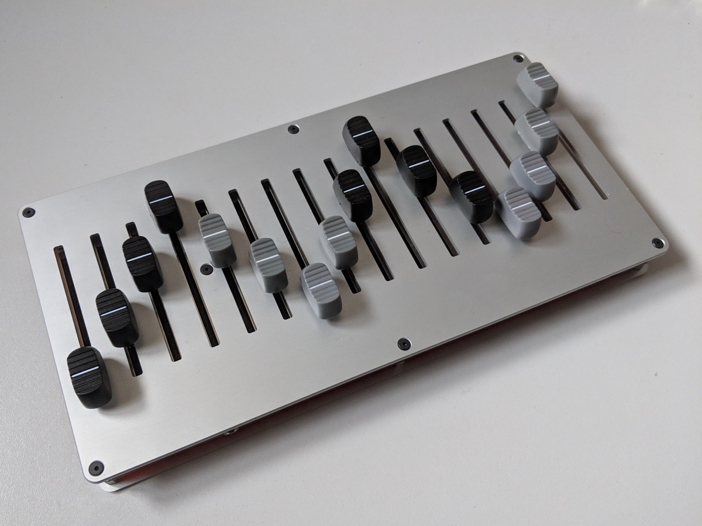

# 16n

Once upon a time, Sean Hellfritsch and Brian Crabtree [made a faderbank][linespost].

**16n** is the revised version of that object: it is open-source and ready for you to make, modify, or hack.

It is currently at version **1.34**.

# Repository contents

- `firmware` is the Teensy source code.
- `electronics` is schematics and gerber files for the PCB.
- `panel` is SVG/DXF files for top and bottom panels.
- `build` is build documentation.
- `browser_test` is a webpage you can use in Google Chrome to test your 16n
  using WebMIDI.

Each directory has further `README` files in for you to read.

## 16n Details

- 16 60mm faders
- sixteen CCs over USB-midi
- sixten CCs over minijack midi (with switch to swap between standards)
- sixteen 0-5V CV output jacks, one per channel.
- I2C: monome-style I2C protocol over TRS (tip is SDA, ring is SCL), works with Monome Teletype; also, I2C MASTER mode, works with monome Ansible, ER-301, TXo, etc (may require firmware patching or modification to connected device).

Power from 5V micro-usb into Teensy on left-hand side, or from your computer.

Toggle switch allows you to swap between 'Arturia/Novation' (tip is current source) and 'Korg/Makenoise' (ring is current source) standards; board is labelled such.

## Give us a picture, then

## User guide

### USB MIDI

Connect USB to computer or other USB host. Faders 1-16 transmit MIDI CC data on CCs 32-47, channel 1. This can be altered in firmware configuration.

### TRS MIDI

Connect USB to computer/USB host, or a USB power supply. Set toggle switch to appropriate MIDI standard. Connect TRS midi converter to MIDI port. (If you have a TRS socket on your MIDI device, you can just use a 3.5mm TRS-TRS cable). Faders 1-16 transmit MIDI CC data on CCs 32-47, channel 1. This can be altered in firmware configuration.

### CV

Connect USB to a USB power supply. Faders 1-16 emit 0-~5V out of their relevant jacks. Connect jack sockets to _inputs_ on your synthesizer. Do **not** connect jack sockets to _outputs_ on your Eurorack system; there is power protection on the Teensy, impedence resistors on the sockets, but damage may occur if you do so.

### I2C

I2C is complex and requires a bit more care when connecting up with your 16n. You can do some very powerful things with it, but you need to be very mindful of a few key points:

- I2C is very picky about cable length. Keep your cable runs as short as possible. If your cables are too long, your bus may “hang” and cause connected instruments to become unresponsive until reboot.
- Connect and disconnect devices only when they are powered down. This keeps your instruments from locking up or being damaged. (I2C just wasn’t designed to be as robust and hot-pluggable as MIDI or USB.)
- Be extremely careful not to connect audio or MIDI cables to the I2C jack. This could damage your 16n’s processor.
- 16n’s I2C jack is a 3.5mm stereo jack wired as follows: tip SDA, ring SCL, and sleeve GND (ground). The various devices in the ecosystem that support I2C order these pins differently. Check your devices documentation or PCB to ensure that you are connecting to it properly.
- Depending on the number of devices on the I2C bus and your configuration, you my need to utilize a bus board to add additional “pull up” resistance to the bus in order to have reliable communications. There are a number of options available for this in the community.

By default, the 16n firmware is set up to work with a monome Teletype out of the box. Make sure you are running the latest Teletype firmware (3.0 as of this writing). Simply connect to the I2C bus and go. The 16n commands are listed in the Teletype documentation available here: [https://monome.org/docs/modular/teletype/manual/#n-faderbank](https://monome.org/docs/modular/teletype/manual/#n-faderbank). These commands allow for the Teletype to programmatically read the position of any of the 16n’s faders.

The “MASTER” version of the 16n firmware causes the 16n to emit commands directly to a number of modules. (You need to compile and/or flash it to your 16n over USB - see the README in the `firmware` directory). It sends CV values to up to four monome Ansible, four bpcmusic TXo, and the Orthogonal Devices’ ER-301 all at the same time. Note: In this configuration, you need to have additional pull-up resistors on the I2C line (as mentioned above). Either use one of the available powered I2C busboards for this purpose or, if you don’t plan on connecting your 16n to a Teletype (which supplies its own pull-up), you can populate the pull-up resistors on the 16n PCB.

"_Can I have multiple faderbanks working over I2C?_" - basically, no. [Brendon has a good explanation here of why not](https://github.com/16n-faderbank/16n/issues/16#issuecomment-455739461)

## BOM

[Available on Octopart][octobom]; a CSV version is in `electronics/bom-csv.csv`

Most parts you can get from eg. Mouser. I recommend buying PJ-302 jacks from [Thonk](https://thonk.co.uk) as an alternative to the more expensive CUI parts. If in doubt, 1% 0805 resistors of any manufacturer will do; caps are X7R with appropriate voltage tolerance.

## Credits

Based on original work by [Brian Crabtree][tehn] and Sean Hellfritsch.  
Minijack MIDI, I2C circuitry and CV outputs by [Tom Armitage][infovore].  
Firmware by [Brian Crabtree][tehn], [Tom Armitage][infovore], and [Brendon Cassidy][bpcmusic].

## Licensing

Panels and electronic schematics/layouts/gerber files are licensed under
[Creative Commons Attribution Share-Alike 4.0][ccbysa].

Firmware is licensed under the [MIT License][mitlicense].

[linespost]: https://llllllll.co/t/sixteen-n-faderbank/3643
[tehn]: https://github.com/tehn
[bpcmusic]: https://github.com/bpcmusic
[infovore]: https://github.com/infovore
[octobom]: https://octopart.com/bom-tool/unJxkzvR
[ccbysa]: https://creativecommons.org/licenses/by-sa/4.0/
[mitlicense]: https://opensource.org/licenses/MIT
