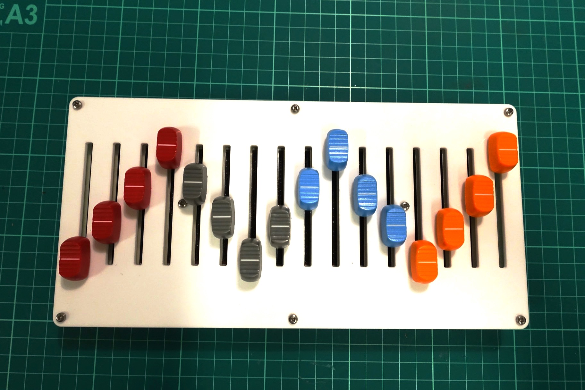

# 16n: build guide

This is a basic build guide for putting a 16n together. 

This guide does _not_ cover things like "how to solder SMT components". It's designed for builders with a degree of experience.

## BEFORE YOU BEGIN

### A NOTE ON TEENSY PREP

Do **not** solder the outside header legs onto your Teensy yet. This bulid is much easier with a Teensy that starts life with no headers attached at all.

### BOARD ORIENTATION

We'll call the side the Teensy is on the LEFT, and the side with sixteen jacks on it the TOP.

### I2C PULLUPS

The two sets of 0805 resistor pads marked `DNP` are pull-ups for the I2C line. Your I2C bus probably won't need these (if you're connecting to, say, a Monome Teletype). If you do need to add pullups to your I2C bus, a pair of 4.7k resistors just here will do the trick.

## BULIDING THE ELECTRONICS

As ever, you want to bulid up your board in height order. So:

* First, solder the eight MCP6004 op-amp ICs. Sloping side should be on the LEFT, same side as the Teensy is.
  

  

  

* Now solder all the resistors and caps. That is:
  * 16 1k resistors along the top
  * 8 100n capacitors by the chips
  * 16 5.6k and 10k resistors by the opamps. The resistors are marked in _columns_ - ie, the silkscreen "5.6k" aligns with a 5.6k in the top 'row' of resistors, and the 5.6k in the bottom 'row' beneath it.
  * Two 47 ohm resistors by the switch

* Next up diodes: four SOD-123 diodes, line should be on the BOTTOM, as marked by the symbol on the board.
  

* Next, through-hole switch. This should snap in and stand just off the board. Make sure it's as flush as it can be and solder it in.
  

* Now the stereo jack sockets for MIDI and I2C. These won't snap in, so make sure they're flush before you solder them.
  

* Now let's do the Teensy. 
  * Before you attach the through hole headers, attach the surface-mount header to the bottom of the Teensy for its 'inner' ins. This is **very hard to do if you already have outer headers on.** Attach only at two opposing corners for now - then put the teensy in place on the board and confirm all the 'outer' pins will also line-up. If so, finish soldering the inner headers.
  * Solder the outer through-hole headers onto the Teensy. Every single one needs to be attached. The best way to do this is:
    * Take two rows of 14 headers, place one on each side, and solder in just one pin on each side. Now try sliding the Teensy into position on the board. You may need to adjust the angle of the fourteen-pin headers. When they're good, solder them in.
      

    * Now do the same with five pins across the front of the Teensy. Again, check the fit.

    * Finally, the 3x1 and 1x1 pins on the inner side; repeat again.

      

      
  * Mount the Teensy into the 16n PCB, flip the board over, and solder it in. (The board is designed for the Teensy to be permanently attached.) The header plastic should be flush with the PCB on the top. Trim all the overhanging legs, one at a time, to get them super-short.
    

* Now the 16 mono jacks. These should push in and stay flush, too - the hole is the size of the mounting pin. Lots of solder to make a good connection.
  

* Finally, the faders. These should snap in to the board and rest against it vertically. They're hard to remove, so make sure you get them straight.
  

## ASSEMBLING THE HARDWARE

Quite easy this:

* the short M-F headers go through the UNDERSIDE of the board
* the M-M headers are on the TOP of the board.
  
* Line up panels, screw in place with M2.5 screws.
* Attach fader knobs or rubber covers to taste - stander 4mm fader knobs will fit.
* Attached rubber feet to base to taste.
  

## FLASHING THE FIRMWARE

Connect Teensy to a computer.

If you're compiling and flashing the firmware, be sure to set the board to Teensy 3.2, MIDI/Serial, 120mhz overclock. Otherwise, just drag the hex file over.

Your 16n should be visible to MIDI software over USB as "16n"; it will be emitting 0-5V CV from each jack, and MIDI from the right minijack according to the standard the switch is set to.

By default, I2C is not set up for 'master' mode (ie: it will work with monome Teletype and similar, but **not** ER-301. To make it work for ER-301, you need to enable 'master' mode in `config.h`).