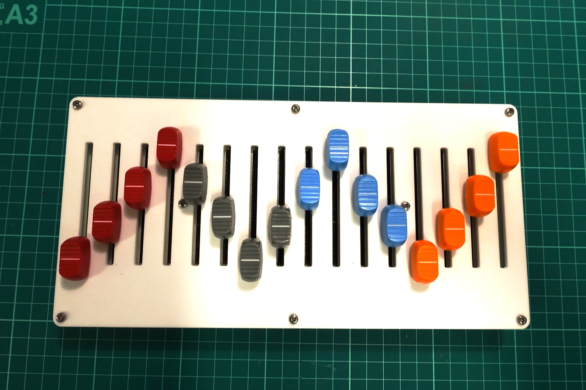

# 16n: build guide

This is a basic build guide for putting a 16n together. 

This guide does _not_ cover things like "how to solder SMT components". It's designed for builders with a degree of experience.

## BEFORE YOU BEGIN

### BOARD ORIENTATION

All the components go on the top of the board - with all the SMD pads on. The through-hole components are soldered on the other side.

Looking down on the board on your desk, we'll call the side the Teensy is on the LEFT, and the side with sixteen jacks on it the TOP.

## BULIDING THE ELECTRONICS

As ever, you want to bulid up your board in height order. Let's do the ICs first:

* `U1` is the 74HC4067 multiplexer: this is the larg(er) IC. The sloping side should be on the LEFT, same side of the board as the Teensy, with the dot (if visible) top left.
* Next: `U2` to `U9` are the eight MCP6004 op-amp ICs. Sloping side should be on the LEFT, same side as the Teensy is, just like the multiplexer.
  

* Now solder all the resistors and caps.
  * `R1`-`R16` are all 1K resistors.

  * `C1`-`C9` are all 100n capacitors.

  * 16 5.6k resistors: `R19, R21, R23, R25, R27, R29, R31, R33, R35, R37, R39, R41, R43, R45, R47, R50`

  * 16 10k resistors: `R20, R22, R24, R26, R28, R30, R32, R34, R36, R38, R40, R42, R44, R46, R48, R51` Along with the 5.6k resistors, these creator a voltage divider to divider the 5V going into the fader down to ~3.3V for the Teensy.

  * `R49` and `R52` are 47 ohm resistors by the switch

    

  * 4.7k resistors `R17` and `R18` are **probably not required** and are thus marked DNP (do not populate)

    * If you don't plan on using I2C, ignore them.
    * If you plan on using I2C with a monome Teletype, do not populate these resistors - it may well cause problems.
    * If you plan on using I2C with an ER-301, Ansible or TXo, (ie I2C "MASTER" mode) you should populate the 4.7K resistors.
* Next up diodes: `D1` to `D4` are four SOD-123 diodes. line should be on the BOTTOM, as marked by the symbol on the board.
  
* Next, through-hole switch. This should snap in and stand just off the board. Make sure it's as flush as it can be and solder it in.
  
* Now the stereo jack sockets for MIDI and I2C. These won't snap in, so make sure they're flush before you solder them.
  
* Now let's do the Teensy. 
  * Solder the outer through-hole headers onto the Teensy. Every single one needs to be attached. The best way to do this is:
    * Take two rows of 14 headers, place one on each side, and solder in just one pin on each side. Now try sliding the Teensy into position on the board. You may need to adjust the angle of the fourteen-pin headers. When they're good, solder them in.
  * Mount the Teensy into the 16n PCB, flip the board over, and solder it in. (The board is designed for the Teensy to be permanently attached.) The header plastic should be flush with the PCB on the top. An easy way to confirm this is to solder one leg, and check the Teensy is flush. If not: heat the pin whilst carefully pushing the Teensy flush - don't push the leg you're heating! Remove the heat, and it'll stay flush with the board. Then complete all the other legs. Trim all the overhanging legs, one at a time, to get them super-short.

  
* Now the 16 mono jacks. These should push in and stay flush, too - the hole is the size of the mounting pin. I recommend getting them in and soldering one pad of all of them. Then, check if they're flush; if not, heat the pad whilst pushing the jack down until it's flush against the board. When that's done, solder the other pads. Lots of solder to make a good connection.
  
* Finally, the faders. These should snap in to the board and rest against it vertically. They're hard to remove, so make sure you get them straight. Four pins at the top, two at the bottom.
  

That's all the electronics done. Before you assemble the hardware, you should **test the board.** To test it, we'll need to flash the firmware.

## FLASHING THE FIRMWARE

Connect Teensy to a computer. Open the `_16n_firmware.ino` file in the Arduino IDE. Make sure you have Teensyduino installed already.

To compile and flash the firmware, open the Tools menu and be sure to set the Board to Teensy 3.2, USB type to MIDI, CPU speed to 120mhz overclock. Flash the board. If there are config changes you wish to make (CC numbers, MIDI channels, enabling the power LED, configuring I2C mode, these can all be found inside `config.h`). However, don't change any CC numbers or MIDI channels *yet* if you plan to test the board with our webpage tester - the test page is only configured for the default configuration.

Your 16n should be visible to MIDI software over USB as "16n".

By default, I2C is not set up for 'master' mode (ie: it will work with monome Teletype and similar, but **not** ER-301/Ansible. To make it work for ER-301, you need to enable 'master' mode in `config.h`, and _ensure_ your pull-up resistors are in place).

## TESTING THE 16N

Once we've flashed the firmware, we can test the board.

There's all sorts of functionality here, but there's some stuff that's easiest tested through the USB-MIDI connection. To that end, move all the faders to the bottom, connect the USB port of the Teensy to your computer, and open the test page up in Google Chrome (or another browser that supports WebMidi, such as Mozilla Firefox). 

Note that the test page expects the default MIDI configuration: Channel 1, CCs 32-47.

Move each fader up and down for its full travel on its own. You should see a bar smoothly rise above the number of that channel for the full 'height' of the box (you'll see). Hopefully, this will all work correctly. If it doesn't, here are some possible catches:

* nothing moves: check the fader pins; check carefully that the opamps are all the right way around and every pin is connected to its pad (and only its pad). Check carefully that the mux is the right way around and every pin on the mux are connected.
* a bar doesn't move nearly far enough; this means the voltage is being divided too much. Check the resistors at the op-amp for that channel (each op-amp handles two channels, left-to-right); one might not be connected or soldered correctly.
* beyond a certain point of travel, *all* the bars move up; this means that too much voltage is flooding into the mux. Again, check the resistors on the op-amp related to that channel - for instance, if channel 14 is causing this problem, check the resistors on the right of the seventh op-amp (U8)

When the USB-MIDI is good, you might want to check the CV. Using a voltmeter or an oscilloscope, measure the voltage at each jack socket as you throw a fader up and down. It should go smoothly from 0V to nearly 5V. If it moves 'suddenly' rather than smoothly, check the op-amp pins are soldered correctly.

By default, TRS-MIDI emits the same data as USB-MIDI. A good way to test it is to power 16n from a mobile phone power adaptor, rather than USB, and watch the traffic. Note that some mini-TRS MIDI dongles can be a little tempramental and require jiggling; this is the universal problem of dongles.

## ASSEMBLING THE ENCLOSURE

The enclosure files can be found in `panel` - there are mechanical drawings and DXF files for the top and bottom. You can cut them on a laser cutter or mill.

Once your board is working, assembling the rest of the hardware is pretty straightforward:

* the short M-F hex standoffs go through the UNDERSIDE of the board, with the thread going through the hole.
* the longer M-M spacers are on the TOP of the board.
  
* Line up the top and bottom panels, and, screw them in place with M2.5 screws.
* Attach fader knobs or rubber covers to taste - standard fader knobs with a 4mm slot will fit. Be careful about pushing these on _too_ hard - they can become difficult to remove should you need to. (I've broken a fader by exerting force on it to lever the top off, for instance).
* Attached rubber feet to base to taste.
  

